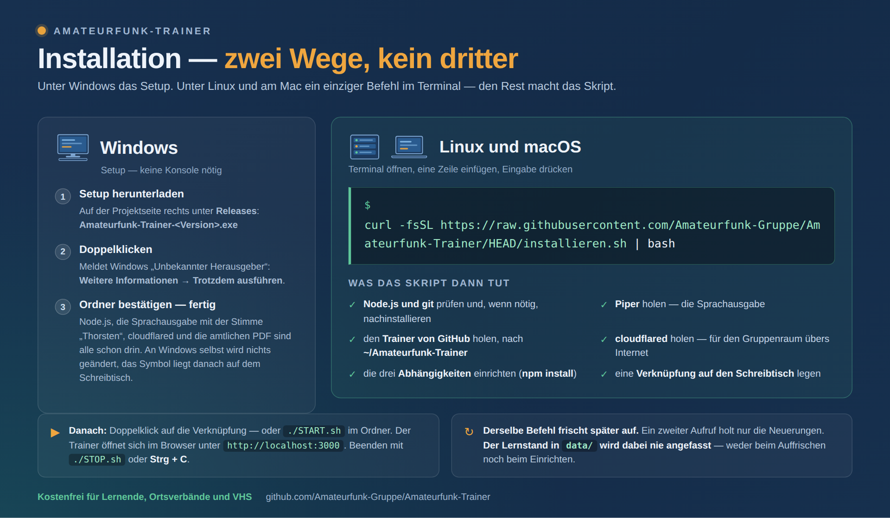

# Installation

Der Amateurfunk-Trainer läuft auf **Windows, Linux und macOS**. Es gibt
zwei Wege, keinen dritten: unter Windows das Setup, unter Linux und am Mac
einen Befehl im Terminal.



---

## Windows

**Keine Konsole nötig.**

1. Auf der Projektseite rechts unter [Releases](../../releases) liegt
   `Amateurfunk-Trainer-<Version>.exe`. Herunterladen.
2. Doppelklicken. Meldet Windows **„Unbekannter Herausgeber"**: auf
   *Weitere Informationen* klicken, dann auf *Trotzdem ausführen*. Die
   Meldung erscheint bei jedem Programm ohne gekauftes Zertifikat — ein
   solches kostet jährlich mehrere hundert Euro, und der Trainer ist ein
   kostenfreies Feierabendprojekt.
3. Ordner bestätigen. Vorgeschlagen ist `C:\Programme\Amateurfunk-Trainer`;
   jeder andere geht auch. Wer sichergehen will, dass Windows schreiben
   darf, wählt etwas unter `C:\Users\<Name>\`.

Fertig. Node.js liegt im Unterordner `node\`, die Sprachausgabe samt der
Stimme „Thorsten", cloudflared und die amtlichen PDF sind ebenfalls dabei.
**An Windows selbst wird nichts installiert und nichts geändert.** Eine
Internetverbindung braucht das Einrichten nicht.

> **Offizielle Setups gibt es ausschließlich hier unter Releases.** Für
> Fassungen aus anderen Quellen kann ich nicht sagen, was darin steckt.

---

## Linux und macOS

**Terminal öffnen** — unter Linux `Strg` + `Alt` + `T`, am Mac
`Cmd` + `Leertaste` und `Terminal` tippen. Dann diese eine Zeile einfügen
und Eingabe drücken:

```bash
curl -fsSL https://raw.githubusercontent.com/Amateurfunk-Gruppe/Amateurfunk-Trainer/HEAD/installieren.sh | bash
```

Das Skript macht der Reihe nach:

1. **Node.js und git prüfen** — und, wenn sie fehlen oder Node älter als 18
   ist, mit dem Paketverwalter des Systems nachinstallieren (apt, dnf,
   pacman, zypper, apk oder Homebrew). Geht das nicht, sagt es, was von Hand
   zu tun ist, und bricht sauber ab.
2. **Den Trainer von GitHub holen** — nach `~/Amateurfunk-Trainer`.
3. **Die Abhängigkeiten einrichten** — `npm install`; es sind drei Pakete
   (express, cors, socket.io).
4. **Die beiden Hilfsprogramme holen** — **Piper** für die Sprachausgabe und
   **cloudflared** für den Gruppenraum übers Internet. Passend zu System und
   Prozessor: Linux x86-64, ARM64 und ARMv7 ebenso wie macOS mit Intel oder
   Apple Silicon.
5. **Eine Verknüpfung auf den Schreibtisch legen** — unter Linux eine
   `.desktop`-Datei (die zusätzlich im Anwendungsmenü auftaucht), am Mac ein
   `Amateurfunk-Trainer.app`.

**Danach:** Doppelklick auf die Verknüpfung. Fragt der Linux-Schreibtisch
beim ersten Mal nach, *Starten erlauben* wählen — das ist bei selbst
angelegten Verknüpfungen normal.

### Lieber erst hineinsehen

`| bash` führt aus, was gerade heruntergeladen wurde. Das ist der
verbreitete Weg (Homebrew macht es genauso), aber wer es lieber prüft, macht
es in zwei Schritten:

```bash
curl -fsSL https://raw.githubusercontent.com/Amateurfunk-Gruppe/Amateurfunk-Trainer/HEAD/installieren.sh -o installieren.sh
less installieren.sh        # ansehen, mit q wieder raus
bash installieren.sh
```

Das Skript ist rund 250 Zeilen und durchgehend deutsch kommentiert.

### Wenn etwas anders liegen soll

```bash
# anderer Zielordner
AFU_ZIEL=/opt/afu-trainer bash installieren.sh

# ohne Piper und cloudflared - später im Trainer nachholbar
AFU_OHNE_HILFSPROGRAMME=1 bash installieren.sh
```

### Auffrischen

**Derselbe Befehl.** Ein zweiter Aufruf holt nur die Neuerungen
(`git pull`), richtet neue Abhängigkeiten ein und lässt alles andere in
Ruhe. **Der Lernstand in `data/` wird dabei nie angefasst** — weder beim
Auffrischen noch beim Einrichten.

### Ohne git

Wer kein git benutzen möchte: auf der Projektseite **Code → Download ZIP**,
entpacken, und im entpackten Ordner:

```bash
npm install
chmod +x START.sh STOP.sh
./START.sh
```

Teilnehmer eines Gruppenraums finden dieselben Dateien hinter dem Knopf
**Trainer herunterladen**.

---

## Nach dem Start

Der Trainer läuft im Browser unter **http://localhost:3000**; `START.sh`
öffnet ihn selbst.

**Beenden:** `./STOP.sh`, oder `Strg` + `C` im selben Fenster. Unter Windows
`STOP.bat` oder `Strg` + `C`. `STOP.sh` beendet dabei **nur, was aus diesem
Ordner heraus läuft** — anders als die Windows-Fassung, die pauschal jedes
`node` beendet; auf einem Linux-Rechner läuft nebenher oft anderes mit.

**Der Lernstand liegt in `data/`.** Für den Umzug auf einen anderen Rechner:
im Trainer auf *Sichern* klicken, die entstandene
`...-Lernstand_<Datum>.json` mitnehmen und drüben mit *Einlesen* einlesen.

**Die Hilfsprogramme nachträglich holen** — falls Schritt 4 übersprungen
wurde oder fehlschlug: **Einstellungen → Wartung → Hilfsprogramme → Holen**.
Von der Konsole geht es auch:

```bash
node programme_holen.js alles          # oder: piper / cloudflared
```

Beide sind **freiwillig** — ohne sie fällt jeweils genau eine Funktion weg,
der Trainer läuft im Übrigen vollständig:

| | wofür | ohne es |
|---|---|---|
| **Piper** | die Sprachausgabe | es wird nicht vorgelesen |
| **cloudflared** | der Tunnel für den Gruppenraum | der Raum bleibt im eigenen Netz |

Nach Piper fehlt noch eine **Stimme**: der Knopf *Stimmen hinzufügen* unter
*Einstellungen → Nachteilsausgleich* holt sie.

---

## Wenn etwas klemmt

**`curl: command not found`** — selten, aber möglich. Dann
`sudo apt install curl` (bzw. `dnf`, `pacman`, `zypper`), oder das Skript
über *Code → Download ZIP* holen.

**Das Skript bricht bei Node.js ab** — die Fassung der Distribution ist zu
alt. Der offizielle Weg für Debian und Ubuntu:

```bash
curl -fsSL https://deb.nodesource.com/setup_22.x | sudo -E bash -
sudo apt install -y nodejs
```

Danach das Installationsskript noch einmal aufrufen.

**„In … liegt schon etwas, das kein Trainer aus git ist"** — im Zielordner
liegt bereits etwas anderes. Umbenennen, oder mit `AFU_ZIEL=<Pfad>` einen
anderen Ort wählen.

**`EADDRINUSE` oder „Port 3000 belegt"** — es läuft schon ein Trainer.
Entweder ist er im Browser bereits offen, oder ein alter Lauf hängt noch:
`./STOP.sh`.

**`./START.sh: Permission denied`** — `chmod +x START.sh STOP.sh`.

**`npm install` bricht ab** — meist kein Netz oder ein Firmen-Proxy
dazwischen.

**Es wird nicht vorgelesen** — Piper fehlt, siehe oben.

**Die Verknüpfung tut nichts (Linux)** — einmal mit der rechten Maustaste
darauf, *Starten erlauben*. Manche Schreibtische verlangen das bei selbst
angelegten `.desktop`-Dateien.

---

## Was geprüft ist und was nicht

Das Installationsskript ist **unter Linux durchgetestet** — Ersteinrichtung,
zweiter Aufruf zum Auffrischen, belegter Zielordner, fehlendes Node.js,
Verknüpfung und Anwendungsmenü. **Windows** läuft im täglichen Gebrauch.
Für **macOS** sind die Wege gebaut, die Dateinamen geprüft und die
`.app`-Struktur nachgerechnet, **aber nicht auf echter Hardware
ausprobiert** — Rückmeldungen sind willkommen.
