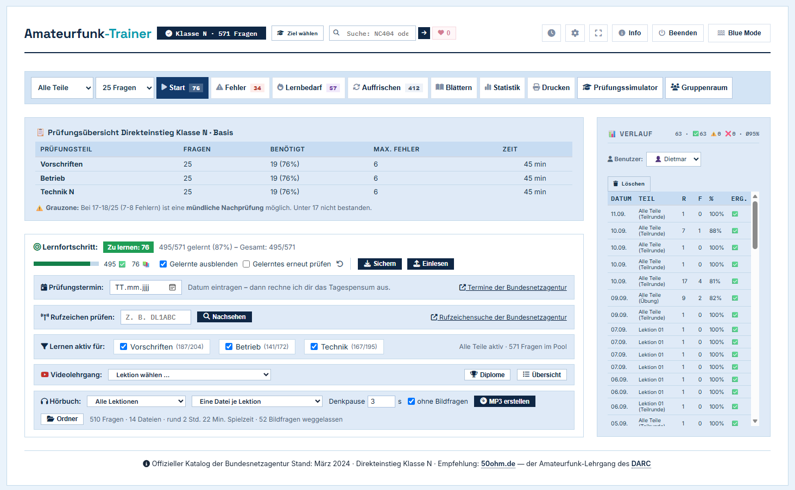
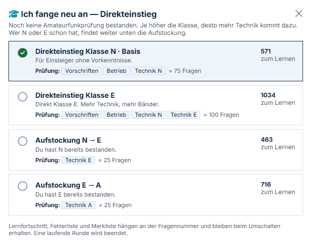
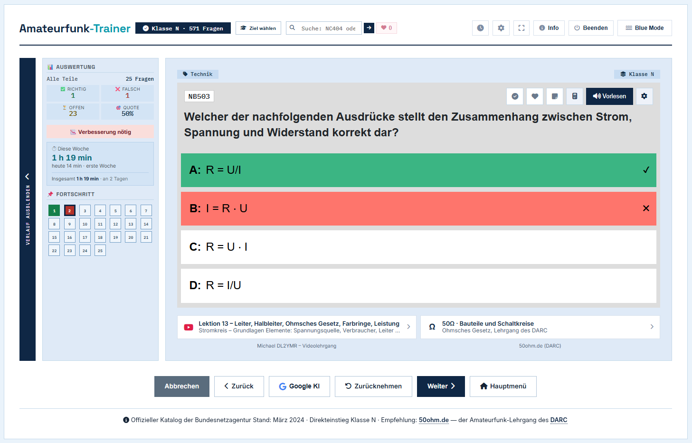
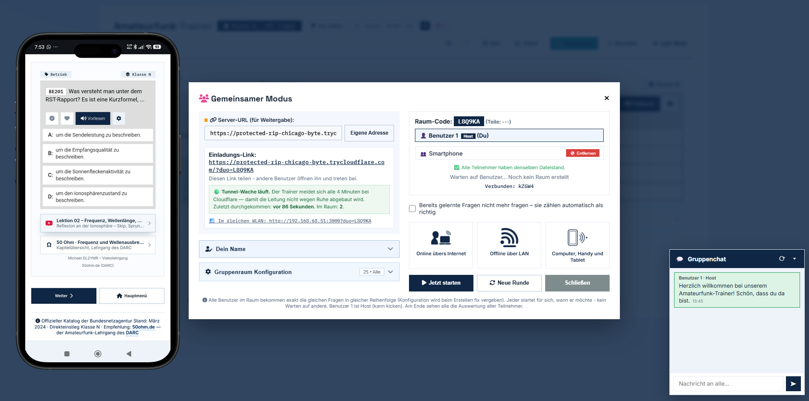
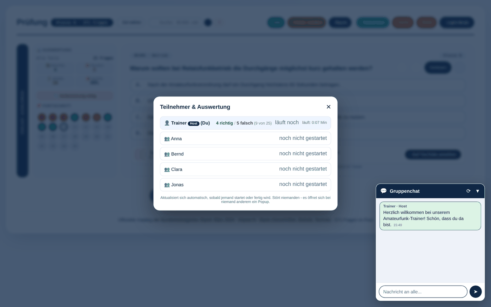
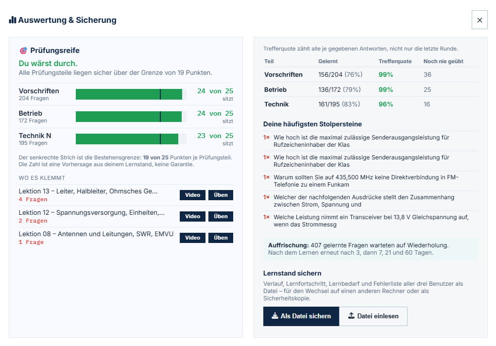
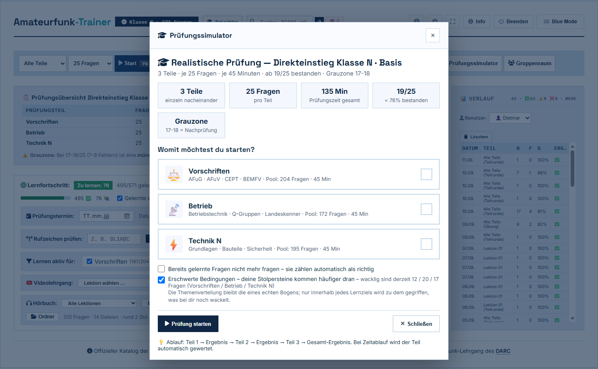
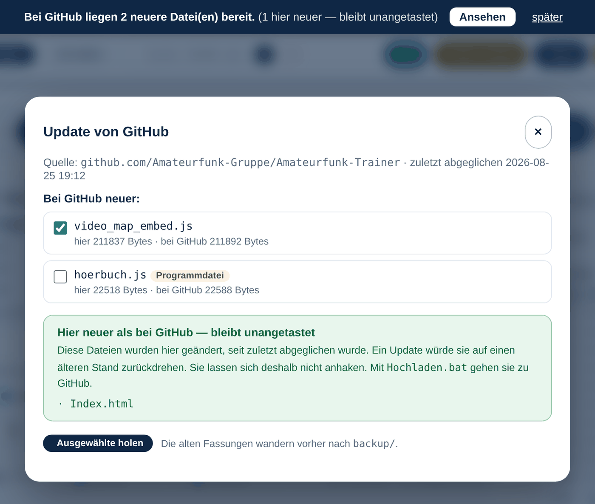

# Amateurfunk-Trainer

Ein Lernprogramm für die deutsche Amateurfunkprüfung — **Klasse N, E und A**.
Läuft auf dem eigenen Rechner, ohne Konto, ohne Internetzwang, ohne Werbung.

Der Lernfortschritt bleibt dort, wo er entsteht: auf dem eigenen Rechner.

Entwickelt von **Dietmar Reh**. Kostenfrei für Lernende, Ortsverbände und
Volkshochschulen — [Einzelheiten unten](#urheberrecht-nutzung-und-kontakt).

## Was es kann

**Sechs Prüfungswege**, umschaltbar über „Ziel wählen":

| Auswahl | Inhalt | Fragen |
|---|---|---|
| Klasse N · Basis | Vorschriften, Betrieb, Technik N | 571 |
| Aufstockung N → E | nur Technik E | 463 |
| Aufstockung E → A | nur Technik A | 716 |
| Aufstockung N → A | Technik E + A | 1179 |
| Direkteinstieg Klasse E | alles von N + Technik E | 1034 |
| Direkteinstieg Klasse A | alles von N + Technik E + A | 1750 |

Vorschriften und Betrieb sind für alle Klassen gleich — die Klassen unterscheiden
sich nur im Prüfungsteil Technik. Beim Aufstieg wird deshalb nur dieser Teil
nachgeschrieben.

**Weiter:**

- **Lernmodus** mit Lernfortschritt, Fehlerliste, Merkliste und Auffrischung
- **Prüfungssimulator** — 25 Fragen, 45 Minuten, 19 zum Bestehen, wie in der echten Prüfung
- **Gruppenraum** — gemeinsam lernen, jeder in seinem Tempo, am Ende die Auswertung aller
- **Sprachausgabe** über [Piper](https://github.com/rhasspy/piper), lokal und offline.
  Abkürzungen werden vor dem Sprechen ausgeschrieben: „145 MHz" wird zu „145 Megahertz"
- **Hörbuch** — Frage, drei Sekunden Stille zum Selbstantworten, richtige Antwort.
  Als MP3 für den USB-Stick im Auto
- **Videolehrgang** — die 14 Lektionen von Michael (DL2YMR) mit den passenden Fragen
- **Prüfungstermin** eintragen, der Trainer rechnet das Tagespensum aus
- **Bedienung per Tastatur** für Menschen, die keine Maus benutzen können

### Beim Lernen

Falsch angekreuzt: die eigene Antwort rot, die richtige daneben. Links die
Auswertung und der Fortschritt durch die Runde, unten die passende Stelle im
Videolehrgang mit Zeitmarke.

### Gruppenraum — für Ortsverbände und Volkshochschulen

Der Trainer ist die passende Ergänzung für alle, die Amateurfunk **unterrichten**:
im Ortsverband, an der Volkshochschule, im Verein.

Der Ausbilder startet den Gruppenraum auf seinem eigenen Rechner und teilt einen
Link. Mehr braucht es nicht:

- **Bei den Teilnehmern wird nichts installiert.** Kein Konto, keine Anmeldung,
  keine App. Der Link geht in jedem Browser auf — Windows, Mac, Linux, Tablet,
  Handy. Nur der Ausbilder braucht den Trainer auf seinem Rechner.
- **Alle bekommen dieselben Fragen**, jeder in seinem Tempo.
- Der Ausbilder sieht in der **Teilnehmer-Übersicht**, wie weit jeder ist und wo
  es hakt — ohne dass bei irgendjemandem ein Fenster aufspringt.
- Ein **Gruppenchat** für Zwischenfragen gehört dazu.
- Am Ende steht die **Auswertung für alle** — und wer will, nimmt sich den
  kompletten Trainer über „Trainer herunterladen" mit nach Hause.

Die Übersicht, die nur der Ausbilder sieht:

### Statistik und Lernfortschritt

Getrennt nach Prüfungsteil: was gelernt ist, wie die Trefferquote über alle je
gegebenen Antworten aussieht, und welche Fragen immer wieder danebengehen. Die
Auffrischung meldet sich nach 3, 7, 21 und 60 Tagen von selbst.

### Prüfungssimulator

Drei Teile zu je 25 Fragen und 45 Minuten, 19 Richtige zum Bestehen — die
Grauzone von 17 bis 18 ist eigens ausgewiesen, weil dort die mündliche
Nachprüfung greift.

### Aktuell bleiben — ohne etwas kaputtzumachen

Der Trainer sagt beim Start selbst Bescheid, wenn hier auf GitHub etwas Neues
liegt. Geholt wird nichts von allein: Ein Balken meldet es, das Fenster unter
**Info → GitHub-Update** zeigt, worum es geht, und erst ein Klick auf
„Ausgewählte holen" ändert etwas im Ordner.

Drei Dinge sind daran wichtig:

- **Eigene Änderungen werden nie überschrieben.** Der Trainer merkt sich, wie
  jede Datei aussah, als sie zuletzt mit GitHub gleich war. Eine Datei, die
  seither hier geändert wurde, steht im grünen Kasten — sie lässt sich gar
  nicht erst anhaken. Ein Fingerabdruck sagt nämlich nur, *dass* zwei Dateien
  verschieden sind, nicht welche die neuere ist.
- **Programmdateien brauchen eine eigene Bestätigung.** `Server.js`,
  `hoerbuch.js` und `lame.js` laufen mit vollen Rechten auf dem Rechner und
  sind deshalb nie vorangehakt.
- **Die alte Fassung wandert vorher nach `backup/`**, und jede geholte Datei
  wird vor dem Schreiben nachgerechnet. Ein abgebrochener Download kommt so
  nie im Ordner an.

## Loslegen

Voraussetzung ist [Node.js](https://nodejs.org) (kostenlos).

    git clone https://github.com/Amateurfunk-Gruppe/Amateurfunk-Trainer.git
    cd Amateurfunk-Trainer
    npm install

Danach Doppelklick auf **START.bat** — der Trainer öffnet sich im Browser.

Für die natürliche Sprachausgabe einmal **piper.bat** ausführen; das lädt rund
80 MB und richtet die deutsche Stimme „Thorsten" ein. Der Trainer läuft auch ohne.

## Herkunft der Fragen

Prüfungsfragen zum Erwerb von Amateurfunkprüfungsbescheinigungen,
Bundesnetzagentur, 3. Auflage, März 2024
([www.bundesnetzagentur.de/amateurfunk](https://www.bundesnetzagentur.de/amateurfunk)),
Datenlizenz Deutschland – Namensnennung – Version 2.0
([www.govdata.de/dl-de/by-2-0](https://www.govdata.de/dl-de/by-2-0)).

Die Daten wurden verändert: Formeln sind von LaTeX nach Unicode umgesetzt, die
Antworten sind gemischt (im Katalog steht die Lösung immer an erster Stelle),
und sechs Fragen mit beim Auslesen zerfallenen Brüchen wurden aus dem
maschinenlesbaren Katalog neu aufgebaut.

Die maschinenlesbare Fassung und die Zeichnungen stammen aus
[fritzsche/afu_test](https://github.com/fritzsche/afu_test).

## Dank

**Michael, DL2YMR** für seinen Videolehrgang zur Klasse N, auf den der Trainer
Lektion für Lektion verweist.

## Mitgelieferte Fremdbestandteile

- `lame.js` — [lamejs](https://github.com/gilmoreorless/lamejs), eine
  JavaScript-Portierung von LAME, unter LGPL 2.1. Wird für die MP3-Ausgabe des
  Hörbuchs gebraucht und liegt bei, damit der Trainer ohne Internet und ohne
  zusätzliche Installation läuft.

## Fehler gefunden?

Im Trainer gibt es oben den Knopf **Fehler melden** — er öffnet eine vorbereitete
Mail, in der Fassung, Prüfungsziel und die gerade angezeigte Frage schon
eingetragen sind. Oder hier ein Issue aufmachen.

## Urheberrecht, Nutzung und Kontakt

Der Amateurfunk-Trainer ist von **Dietmar Reh** entwickelt worden. Programmcode,
Texte, Aufbau und Gestaltung stehen unter seinem Urheberrecht.

**Der Trainer ist und bleibt kostenfrei.** Er darf benutzt, kopiert, verändert
und weitergegeben werden — solange damit kein Geld verdient wird. Ausdrücklich
erlaubt und erwünscht ist die Nutzung durch einzelne Lernende, Ortsverbände,
Vereine, Volkshochschulen, Schulen und Ausbilder. Auch dann, wenn für den Kurs
ein Teilnehmerbeitrag erhoben wird — der Trainer selbst darf nur nicht zur Ware
werden.

**Nicht erlaubt** ist, ihn oder Teile davon zu verkaufen, in ein
kostenpflichtiges Angebot einzubauen oder anderweitig gewerblich zu verwerten.

Maßgeblich ist die [PolyForm Noncommercial License 1.0.0](LICENSE) — eine
Lizenz, die eigens für diesen Fall geschrieben wurde: Weitergabe ja, Verkauf
nein. Bildungseinrichtungen sind darin ausdrücklich eingeschlossen.

**Anfragen sind willkommen.** Wer den Trainer im Ortsverband oder an der VHS
einsetzen möchte, ihn für seinen Kurs anpassen will oder eine Zusammenarbeit
vorschlägt: einfach fragen — über den Knopf **Fehler melden** im Trainer oder
hier ein Issue. Das gilt auch für alles, was über die Lizenz hinausgeht.

Für mitgelieferte Fremdbestandteile gilt weiter die Lizenz ihrer Urheber:
`lame.js` unter LGPL 2.1, der Fragenkatalog unter der Datenlizenz Deutschland,
die Zeichnungen sind gemeinfrei. Einzelheiten in [LICENSE](LICENSE).
