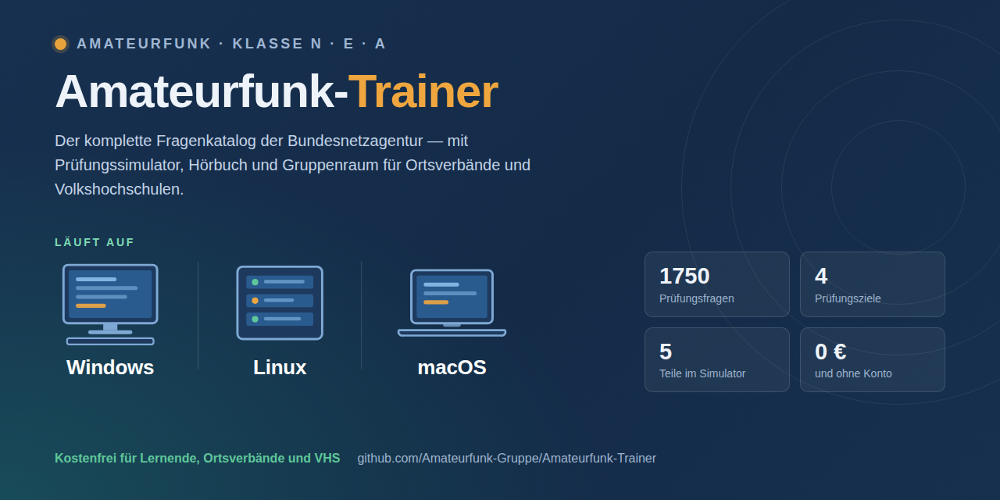
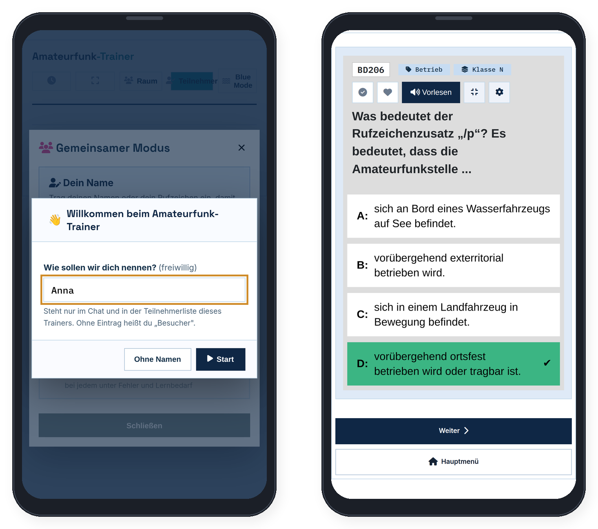
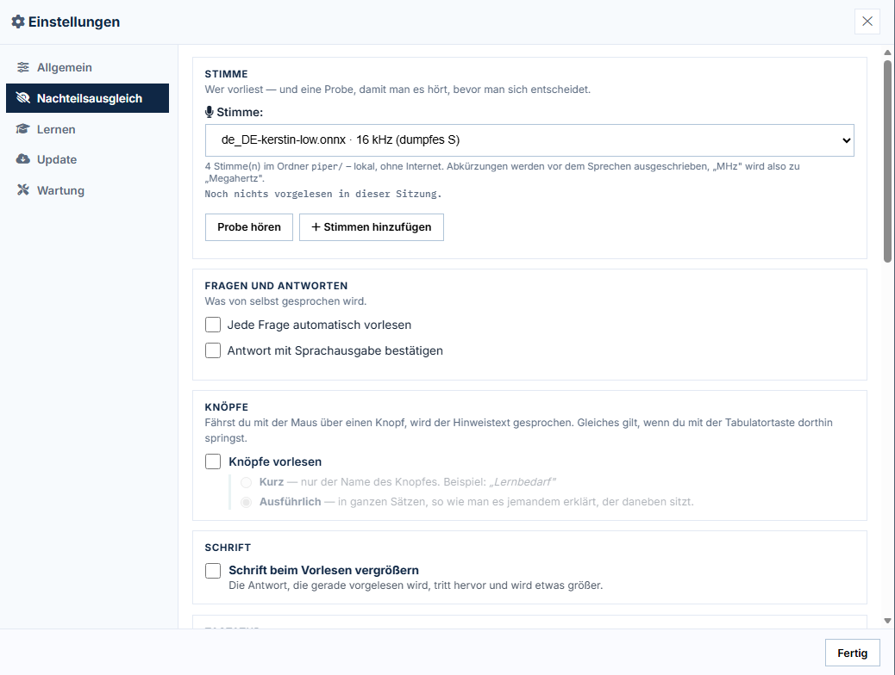

  

# Amateurfunk-Trainer

Ein Lernprogramm für die deutsche Amateurfunkprüfung — **Klasse N, E und A**.
Läuft auf dem eigenen Rechner, ohne Konto, ohne Internetzwang, ohne Werbung.

Der Lernfortschritt bleibt dort, wo er entsteht: auf dem eigenen Rechner.

Entwickelt von **Dietmar Reh**. Kostenfrei für Lernende, Ortsverbände und
Volkshochschulen — [Einzelheiten unten](#urheberrecht-nutzung-und-kontakt).

## Was es kann

**Sechs Prüfungswege**, umschaltbar über „Ziel wählen":

| Auswahl | Prüfung | Fragen zum Lernen |
|---|---|---|
| Direkteinstieg Klasse N · Basis | Vorschriften · Betrieb · Technik N | 571 |
| Direkteinstieg Klasse E | Vorschriften · Betrieb · Technik N · Technik E | 1034 |
| Aufstockung N → E | nur Technik E | 463 |
| Aufstockung E → A | nur Technik A | 716 |
| **Einstieg CB → N** | Vorschriften · Betrieb · Technik N | **433** |

Vorschriften und Betrieb sind für alle Klassen gleich — die Klassen unterscheiden
sich nur im Prüfungsteil Technik. Beim Aufstieg wird deshalb nur dieser Teil
nachgeschrieben. Wer Klasse A anstrebt, geht den Weg N → E → A.

Das Fenster trennt die Fälle, die in der Praxis dauernd verwechselt werden:
**Direkteinstieg** (noch keine Bescheinigung — je höher die Klasse, desto mehr
Technik kommt dazu) und **Aufstockung** (Bescheinigung vorhanden — nur die
fehlende Technik, kein Vorschriften und kein Betrieb mehr). Jede Zeile sagt
vorher, welche Prüfungsbögen dazugehören und wie viele Fragen zu lernen sind.

### Einstieg CB → N

Wer vierzig Jahre CB gefunkt hat, muss nicht bei Null anfangen. Antennenbau,
S-Meter, SWR, PL/N/SMA/BNC, LSB/USB, AM/FM/SSB, die Q-Gruppen, Plus und Minus,
Sicherung, Stromkreise und P = U · I — das sitzt.

Dieses Prüfungsziel rechnet genau **138 der 571 Fragen als bekannt an**, der
Lernstapel schrumpft damit auf **433**. Aus den Vorschriften wird **keine
einzige** Frage abgezogen: AFuG, AFuV, Bandpläne, Rufzeichen, CEPT und EMVU
kommen im CB-Funk nicht vor.

Die Regel bei jedem Zweifelsfall war **im Zweifel nicht abziehen** — die
Prüfung soll ja bestanden werden. Welche 138 es sind und warum, steht mit
Begründung in [CB-Einstieg.md](CB-Einstieg.md). Im Trainer lässt sich jede
einzelne Frage per Kästchen zurückholen, und **der Prüfungssimulator zieht
weiterhin aus allen 571** — genau wie die Bundesnetzagentur.

**Weiter:**

- **Lernmodus** mit Lernfortschritt, Fehlerliste, Merkliste und Auffrischung
- **Prüfungssimulator** — 25 Fragen, 45 Minuten, 19 zum Bestehen, wie in der echten Prüfung
- **Gruppenraum** — gemeinsam lernen, jeder in seinem Tempo, am Ende die Auswertung aller
- **Sprachausgabe** über [Piper](https://github.com/rhasspy/piper), lokal und offline.
  Abkürzungen werden vor dem Sprechen ausgeschrieben: „145 MHz" wird zu „145 Megahertz"
- **Hörbuch** — Frage, drei Sekunden Stille zum Selbstantworten, richtige Antwort.
  Als MP3 für den USB-Stick im Auto
- **Videolehrgang** — die 14 Lektionen von Michael (DL2YMR) mit den passenden Fragen
- **Prüfungstermin** eintragen, der Trainer rechnet das Tagespensum aus
- **Durchsehen** — alle Fragen der Reihe nach, mit Lesezeichen an der Stelle,
  an der du aufgehört hast
- **Nachteilsausgleich** — Vorlesen, Tastaturbedienung, Antwort zurücknehmen,
  automatisch weiterblättern, größere Bilder und verlängerte Prüfungszeit,
  alles einzeln an- und abschaltbar ([mehr dazu](#nachteilsausgleich))

### Beim Lernen

Falsch angekreuzt: die eigene Antwort rot, die richtige daneben. Links die
Auswertung und der Fortschritt durch die Runde, unten die passende Stelle im
Videolehrgang mit Zeitmarke.

### Die Formelsammlung an der Frage

In der Prüfung wird die Formelsammlung der Bundesnetzagentur **ausgehändigt**
— sie ist amtliches Hilfsmittel, kein Schummeln. Wer ohne sie übt, übt
schwerer als die Prüfung ist.

Bei jeder Frage, zu der es eine passende Stelle gibt, steht deshalb ein Knopf
**Formelblatt**. Ein Klick zeigt die Seite — und die betreffende Stelle ist
hervorgehoben, der Rest abgedunkelt.

Das ist der eigentliche Punkt: Man sieht, **wo** im Blatt man ist, nicht nur
was dort steht. In der Prüfung muss man die Stelle schließlich auch finden.
Blättern geht trotzdem, und „Ganze Seite" nimmt die Abdunklung weg.

Enthalten ist das vollständige Hilfsmittel: die Formelsammlung, die
IARU-Bandpläne und die Tabellen mit Frequenzbereichen und zulässigen
Sendeleistungen. Rund 480 Fragen im gesamten Katalog haben einen solchen Hinweis.

Gezeigt wird das amtliche Blatt als Bild, nicht abgetippt. Das PDF benutzt
Sonderschriften mit eigener Zeichenzuordnung — aus „Nutzungsbedingungen" wird
beim maschinellen Auslesen `I"/0"'9*-)(>'9"'9)'`. Jede abgetippte Formel wäre
eine mögliche Fehlerquelle; so steht dort, was auch auf dem Tisch der Prüfung
liegt.

### Gruppenraum — für Ortsverbände und Volkshochschulen

Der Trainer ist die passende Ergänzung für alle, die Amateurfunk **unterrichten**:
im Ortsverband, an der Volkshochschule, im Verein.

Der Ausbilder startet den Gruppenraum auf seinem eigenen Rechner und teilt einen
Link. Mehr braucht es nicht:

- **Bei den Teilnehmern wird nichts installiert.** Kein Konto, keine Anmeldung,
  keine App. Der Link geht in jedem Browser auf — Windows, Mac, Linux, Tablet,
  Handy. Nur der Ausbilder braucht den Trainer auf seinem Rechner.
- **Alle bekommen dieselben Fragen**, jeder in seinem Tempo.
- Der Ausbilder sieht in der **Teilnehmer-Übersicht**, wie weit jeder ist und wo
  es hakt — ohne dass bei irgendjemandem ein Fenster aufspringt.
- Ein **Gruppenchat** für Zwischenfragen gehört dazu.
- Am Ende steht die **Auswertung für alle** — und wer will, nimmt sich den
  kompletten Trainer über „Trainer herunterladen" mit nach Hause.

### Am Handy und am Tablet

Wer über den Einladungslink hereinkommt, bekommt eine eigene, aufgeräumte
Ansicht — keine verkleinerte Rechnerseite.

  

- **Name eintragen, mitmachen, los.** Ein Feld, ein Knopf. Ohne Namen geht es
  nicht weiter — sonst steht man bei allen anderen als „Benutzer 1" in der
  Liste. Nach dem Tippen beginnt sofort die erste Frage.
- **Nur der Raum, kein Hauptmenü.** Filterleiste, Prüfungsübersicht,
  Lernfortschritt und Verlauf gehören zum eigenen Lernen am eigenen Rechner —
  im Raum entscheidet der Ausbilder, was gefragt wird. Übrig bleiben
  **Weiter**, **Hauptmenü** und der Farbstil.
- **Am Ende die Auswertung.** Sind alle durch, startet der Ausbilder mit einem
  Knopf eine **neue Runde** — frische Fragen für alle, jeder wieder bei null.
- **Fingermaße statt Mausmaße.** Antworten und Knöpfe mindestens 44 Punkte
  hoch, die Frage steht oben, nichts läuft seitlich aus dem Bild.

**Als App auf dem Startbildschirm.** Der Trainer bringt ein Web-App-Manifest
und einen Service Worker mit. Über „Zum Startbildschirm hinzufügen" landet er
mit eigenem Symbol auf dem Handy und startet **ohne Adressleiste** — wie eine
installierte App. Dafür muss die Seite über **https** erreichbar sein: über den
Tunnel-Link also ja, über die nackte LAN-Adresse (`http://192.168.…`) nicht.
Dort läuft der Trainer trotzdem, nur eben ohne Symbol.

### Nachteilsausgleich

Die Amateurfunkprüfung ist eine schriftliche Prüfung am Bildschirm, und nicht
jeder kann sie so ablegen, wie sie gedacht ist. Die Bundesnetzagentur trägt dem
Rechnung: Nach der Amtsblatt-Verfügung 29/2024 sind „Menschen mit Behinderung
ihrer Behinderung entsprechende Erleichterungen bei der Prüfungsdurchführung zu
gewähren". Wer das braucht, legt bei der Anmeldung ein ärztliches Attest oder
einen vergleichbaren Nachweis bei; über Art und Umfang entscheidet die
zuständige Stelle im Einzelfall — bis hin zur Einzelprüfung oder einer
mündlichen Abnahme.

Der Trainer bringt alles, was sich davon üben lässt, an **einer** Stelle
zusammen: **Einstellungen → Nachteilsausgleich**. Nichts davon ist vorgegeben,
jede Funktion lässt sich einzeln an- und abschalten.

**Vorlesen.** Die Sprachausgabe läuft über [Piper](https://github.com/rhasspy/piper)
— **lokal auf dem eigenen Rechner, ohne Internet**, mit vier deutschen Stimmen
zur Auswahl und einer Hörprobe. Abkürzungen werden vor dem Sprechen
ausgeschrieben: aus „145 MHz" wird „145 Megahertz", aus „LAN" nicht „elan".
Wahlweise wird **jede Frage automatisch** gesprochen, und die **Antwort mit
Sprachausgabe bestätigt** — bei einem Fehler gleich mit der richtigen Antwort
dazu, damit man sich nicht durch vier Kacheln tasten muss. Im
Prüfungssimulator schweigt der Trainer an dieser Stelle: Dass es richtig war,
erfährt man in der echten Prüfung auch nicht.

**Knöpfe vorlesen.** Wer mit der Maus über einen Knopf fährt oder mit der
Tabulatortaste dorthin springt, bekommt gesagt, was er tut — wahlweise **kurz**
(nur der Name) oder **ausführlich** (in ganzen Sätzen, so wie man es jemandem
erklärt, der daneben sitzt). Jede Funktion im Trainer hat dafür einen eigenen,
von Hand geschriebenen Satz; im Reiter Nachteilsausgleich selbst hat ihn jedes
einzelne Kästchen und jedes Auswahlfeld.

**Schrift beim Vorlesen vergrößern.** Die Antwort, die gerade gesprochen wird,
tritt hervor und wird größer — Auge und Ohr bleiben zusammen.

**Bedienung per Tastatur.** Die Tasten **1 bis 4** beantworten die Frage,
**Enter** blättert weiter, die **Rücktaste** zurück. Zusätzlich wird jede
Rückmeldung für Vorleseprogramme angesagt. Ohne Haken bleibt alles wie bisher —
mit der Tabulatortaste lassen sich die Antworten so oder so anspringen.

**Antwort zurücknehmen.** Ein Fehlklick ist keine falsche Antwort, sondern eine
verrutschte Hand. Nach dem Antworten steht **Zurücknehmen** in der Knopfreihe
unter der Frage, alternativ **Strg+Z**. Zurückgenommen wird *alles*, was die
Antwort ausgelöst hat: die Wertung, die Fehlerliste, der Lernbedarf mit seinen
Zählern und der Lernfortschritt. Es gilt für die gerade offene Frage — wer
weiterblättert, lässt die Antwort stehen.

**Automatisch weiterblättern.** Nach der Antwort geht es ohne Klick zur
nächsten Frage, wahlweise nach 2, 3, 5, 8 oder 12 Sekunden — beim Lernen, im
Prüfungssimulator und im Gruppenraum. Im Knopf läuft ein sichtbarer Zähler
mit. Zwei Dinge sind dabei fest eingebaut: Solange **vorgelesen** wird, steht
der Zähler still — die Ansage wird nie abgeschnitten. Und die **letzte Frage
bleibt stehen**; ins Ergebnis mit Auswertung und Konfetti geht es nur auf
Klick. Jede Taste und jeder Klick halten den Zähler an.

**Bilder stärker vergrößern.** Fährt man über ein Schaltzeichen, wächst es an
seiner Stelle. Wie weit, ist einstellbar — von *ein Drittel größer* bis *so groß
wie möglich*. Gemessen an einem 120 × 80 großen Schaltzeichen sind das 392
Punkte in der Grundeinstellung und bis zu 917 Punkte in der größten Stufe.

**Verlängerte Prüfungszeit.** Der Prüfungssimulator und die Prüfungsübersicht
rechnen dann mit mehr Zeit, damit das Üben dem entspricht, was am Prüfungstag
gilt. Zur Wahl stehen ein Viertel, ein Drittel (aus 45 Minuten werden 60), die
Hälfte oder die doppelte Zeit.

> **Wichtig, und im Trainer steht es genauso:** Es gibt **keine feste Zahl**.
> In der Verfügung 29/2024 stehen nur die regulären Zeiten — 45 Minuten je
> Teil, 60 Minuten für Technik Klasse A — und der Satz zu den Erleichterungen.
> *Wie viel* mehr Zeit gewährt wird, entscheidet die Bundesnetzagentur im
> Einzelfall. Was hier eingestellt ist, gilt also nur zum Üben und ist keine
> Zusage.

Dazu passt, was an anderer Stelle schon da ist: die **Anzeigegröße** unter
*Einstellungen → Allgemein*, getrennt für die normale Ansicht und für das
Vollbild, in Fünferschritten von 60 bis 115 Prozent — der Trainer muss auch auf
einem 15-Zoll-Laptop vollständig auf den Bildschirm passen. Und der
**Beamer-Modus** (Strg+B) zeigt nur Frage und Antworten, dreimal so groß.

### Statistik und Lernfortschritt

Getrennt nach Prüfungsteil: was gelernt ist, wie die Trefferquote über alle je
gegebenen Antworten aussieht, und welche Fragen immer wieder danebengehen. Die
Auffrischung meldet sich nach 3, 7, 21 und 60 Tagen von selbst.

### Prüfungssimulator

Echte Prüfungsbedingungen: 25 Fragen und 45 Minuten je Teil, 19 Richtige zum
Bestehen — die Grauzone von 17 bis 18 ist eigens ausgewiesen, weil dort die
mündliche Nachprüfung greift. Der Technikteil der Klasse A hat 60 Minuten.

**Welche Teile anstehen, entscheidet das gewählte Prüfungsziel** — genauso wie
bei der Bundesnetzagentur. Wer schon eine Bescheinigung hat, schreibt die alten
Bögen nicht noch einmal:

| Prüfungsziel | Teile im Simulator |
|---|---|
| Klasse N · Basis | Vorschriften · Betrieb · Technik N |
| Klasse E | Vorschriften · Betrieb · Technik N · Technik E |
| Aufstockung N → E | nur Technik E |
| Aufstockung E → A | nur Technik A |
| Einstieg CB → N | Vorschriften · Betrieb · Technik N |

Die Prüfungsübersicht auf der Hauptseite zeigt dieselben Teile — beide lesen
aus demselben Fragenkatalog, sie können sich also nicht widersprechen.

### Aktuell bleiben — ohne etwas kaputtzumachen

Der Trainer sieht beim Start selbst nach, ob hier auf GitHub etwas Neues
liegt. **Unterbrochen wird dabei nichts** — kein Fenster springt auf, kein
Balken legt sich über die Seite. Stattdessen wird der **Info**-Knopf oben
rechts zum **Update**-Knopf: anderer Name, andere Farbe, und er blinkt.
Dazu spielt einmal ein kurzer Ton.

Ein Klick darauf öffnet ein kleines Fenster: *Update vorhanden*, ein Satz,
zwei Knöpfe — **Aktualisieren** oder **Später**. Keine Dateinamen, keine
Byte-Zahlen, keine Kästchen zum Ankreuzen.

Die Kästchen gab es einmal, und sie waren ein Fehler: Eine Liste mit
Kästchen sieht nach freier Auswahl aus, aber an den Dateinamen kann niemand
ablesen, welche Kombination heil ist — `Server.js` ohne `github_update.js`
zum Beispiel ist keine. Alles oder nichts ist die einzige Auswahl, bei der
nichts Halbes entstehen kann.

Was dabei geschieht, ist deshalb nicht weniger sorgfältig:

- **Eigene Änderungen werden nie überschrieben.** Der Trainer merkt sich, wie
  jede Datei aussah, als sie zuletzt mit GitHub gleich war. Was seither hier
  geändert wurde, bleibt unangetastet. Ein Fingerabdruck sagt nämlich nur,
  *dass* zwei Dateien verschieden sind, nicht welche die neuere ist.
- **Die alte Fassung wandert vorher nach `backup/`**, und jede geholte Datei
  wird vor dem Schreiben nachgerechnet. Ein abgebrochener Download kommt so
  nie im Ordner an.
- **Der Lernstand in `data/` wird nie angefasst.**
- **„Später" merkt sich nichts.** Beim nächsten Start meldet es sich wieder.
  Vergessen kann man ein Update damit nicht, wegklicken jederzeit.

Waren Programmdateien dabei, sagt das Fenster danach, dass der Trainer einmal
neu gestartet werden muss.

## Loslegen

**Setup herunterladen, doppelklicken, fertig.**

Rechts unter [Releases](../../releases) liegt
`Amateurfunk-Trainer-<Version>.exe`. Herunterladen, doppelklicken, dem
Assistenten folgen — mehr ist es nicht.

> **Offizielle Setups gibt es ausschließlich hier unter Releases.** Für
> Fassungen aus anderen Quellen kann ich nicht sagen, was darin steckt.

Das Setup bringt alles mit, was der Trainer braucht:

- **Node.js** im Unterordner `node\` — auf dem Rechner wird nichts
  installiert und nichts an Windows geändert
- **die natürliche Sprachausgabe** samt der deutschen Stimme „Thorsten"
- **die amtlichen Unterlagen** — Fragenkatalog und Formelsammlung als PDF
- **das Startsymbol** auf dem Desktop, auf Wunsch auch in der Taskleiste

Eine Internetverbindung wird beim Einrichten nicht gebraucht. Der Trainer
läuft danach vollständig ohne Netz; ins Internet geht er nur, wenn Sie
selbst einen Gruppenraum öffnen oder nach Neuerungen sehen lassen.

**Wohin installiert wird, fragt der Assistent.** Vorgeschlagen ist
`C:\Programme\Amateurfunk-Trainer`; jeder andere Ordner geht auch. Wer
lieber im eigenen Benutzerkonto bleibt, wählt zum Beispiel
`C:\Users\<Name>\Amateurfunk-Trainer` — dort darf Windows in jedem Fall
schreiben.

**Der Lernstand liegt in `data\`** und bleibt bei einem Update erhalten.
Wer auf einen anderen Rechner wechselt, klickt im Trainer auf „Sichern",
nimmt die entstandene `...-Lernstand_<Datum>.json` mit und liest sie
drüben mit „Einlesen" wieder ein.

**„Unbekannter Herausgeber".** Windows zeigt diese Warnung bei jedem
Programm, das nicht mit einem gekauften Zertifikat signiert ist — ein
solches Zertifikat kostet jährlich mehrere hundert Euro, und der Trainer
ist ein kostenfreies Feierabendprojekt. Auf „Weitere Informationen" und
dann „Trotzdem ausführen" klicken. Wem das zu weit geht: Der Quellcode
liegt vollständig hier, das Setup lässt sich mit
[Inno Setup](https://jrsoftware.org/isinfo.php) und `Build-DIREKT.bat`
selbst bauen.

**Ohne Setup, direkt aus dem Quellcode.** Wer den Trainer lieber selbst
startet: Repository klonen oder als ZIP herunterladen, Node.js
installieren, im Ordner einmal `npm install`, dann `node Server.js`.
Entwickelt und getestet ist unter Windows; `Server.js` ist gewöhnliches
Node.js und sollte auch unter macOS und Linux starten — nachgeprüft ist
das nicht.

## Beenden und neu starten

Der Trainer läuft im Browser, der Server dahinter unsichtbar im
Hintergrund. Zum Beenden gibt es **`STOP.bat`** im Programmordner. Und
wenn beim Start nichts zu passieren scheint, meldet sich der Trainer
inzwischen selbst: Läuft schon einer auf Port 3000 — etwa aus einem alten
Ordner —, fragt er nach, ob er ihn beenden und neu starten soll.

## Herkunft der Fragen

Prüfungsfragen zum Erwerb von Amateurfunkprüfungsbescheinigungen,
Bundesnetzagentur, 3. Auflage, März 2024
([www.bundesnetzagentur.de/amateurfunk](https://www.bundesnetzagentur.de/amateurfunk)),
Datenlizenz Deutschland – Namensnennung – Version 2.0
([www.govdata.de/dl-de/by-2-0](https://www.govdata.de/dl-de/by-2-0)).

Die Daten wurden verändert: Formeln sind von LaTeX nach Unicode umgesetzt, die
Antworten sind gemischt (im Katalog steht die Lösung immer an erster Stelle),
und sechs Fragen mit beim Auslesen zerfallenen Brüchen wurden aus dem
maschinenlesbaren Katalog neu aufgebaut.

Die maschinenlesbare Fassung und die Zeichnungen stammen aus
[fritzsche/afu_test](https://github.com/fritzsche/afu_test).

## Dank

**Michael, DL2YMR** für seinen Videolehrgang zur Klasse N, auf den der Trainer
Lektion für Lektion verweist.

## Mitgelieferte Fremdbestandteile

- `lame.js` — [lamejs](https://github.com/gilmoreorless/lamejs), eine
  JavaScript-Portierung von LAME, unter LGPL 2.1. Wird für die MP3-Ausgabe des
  Hörbuchs gebraucht und liegt bei, damit der Trainer ohne Internet und ohne
  zusätzliche Installation läuft.

## Fehler gefunden?

Im Trainer gibt es oben den Knopf **Fehler melden** — er öffnet eine vorbereitete
Mail, in der Fassung, Prüfungsziel und die gerade angezeigte Frage schon
eingetragen sind. Oder hier ein Issue aufmachen.

## Urheberrecht, Nutzung und Kontakt

Der Amateurfunk-Trainer ist von **Dietmar Reh** entwickelt worden. Programmcode,
Texte, Aufbau und Gestaltung stehen unter seinem Urheberrecht.

**Der Trainer ist und bleibt kostenfrei.** Er darf benutzt, kopiert, verändert
und weitergegeben werden — solange damit kein Geld verdient wird. Ausdrücklich
erlaubt und erwünscht ist die Nutzung durch einzelne Lernende, Ortsverbände,
Vereine, Volkshochschulen, Schulen und Ausbilder. Auch dann, wenn für den Kurs
ein Teilnehmerbeitrag erhoben wird — der Trainer selbst darf nur nicht zur Ware
werden.

**Nicht erlaubt** ist, ihn oder Teile davon zu verkaufen, in ein
kostenpflichtiges Angebot einzubauen oder anderweitig gewerblich zu verwerten.

Maßgeblich ist die [PolyForm Noncommercial License 1.0.0](LICENSE) — eine
Lizenz, die eigens für diesen Fall geschrieben wurde: Weitergabe ja, Verkauf
nein. Bildungseinrichtungen sind darin ausdrücklich eingeschlossen.

**Anfragen sind willkommen.** Wer den Trainer im Ortsverband oder an der VHS
einsetzen möchte, ihn für seinen Kurs anpassen will oder eine Zusammenarbeit
vorschlägt: einfach fragen — über den Knopf **Fehler melden** im Trainer oder
hier ein Issue. Das gilt auch für alles, was über die Lizenz hinausgeht.

Für mitgelieferte Fremdbestandteile gilt weiter die Lizenz ihrer Urheber:
`lame.js` unter LGPL 2.1, der Fragenkatalog unter der Datenlizenz Deutschland,
die Zeichnungen sind gemeinfrei. Einzelheiten in [LICENSE](LICENSE).
